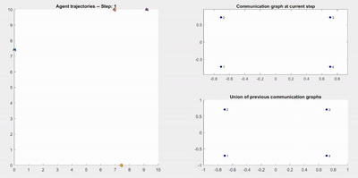

# agent_random_coordination
Multi-agent simulation to study emergent connected communications graphs. Each agent behaves selfishly to explore a space enclosed by logical boundaries, only communicating when coincidently near another agent.

Run the simulation in MATLAB via: `simple_comm_by_opportunity`

##### Simulation

##### Estimation convergence
